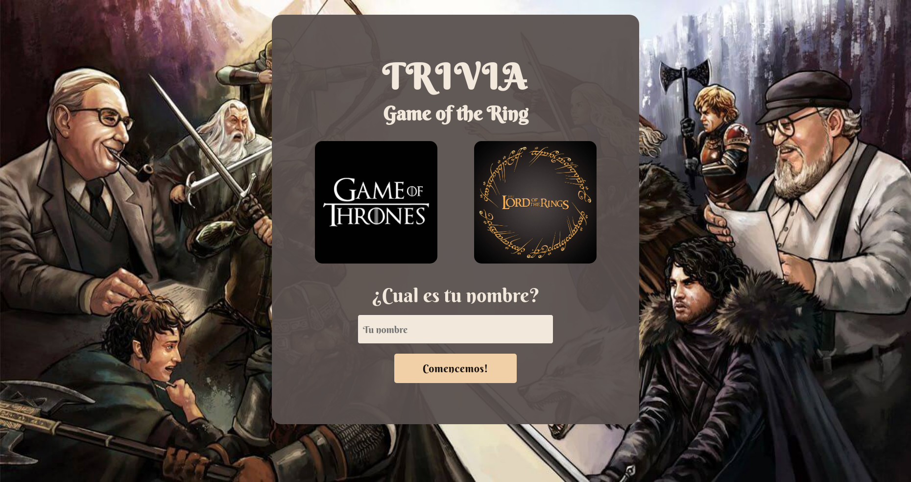

# Trivia Game of The Ring

This is a Trivia Game of Game of Thrones and  The Lord of The Ring. 

All the feedback and contributions are welcome. 🙋🏾

## Features

- Add name and selection of topic for the questions.
- Show questions and selection of answer.
- Countdown of 30 seconds for each questions.
- Results page with correct and incorrect answers.

## Run the project

To run the this project you can use any server to run the index.html file.

For example: “Live Server” from Visual Studio Code.

## **Built with**

Technologies used in the project:

- JavaScript Vanilla
- CSS3
- HTML5

This project follows a a project from [Laboratoria’s Bootcamp](https://github.com/Laboratoria/BOG004-trivia). I carry out the project as a personal practice and as a self-taught person.

## License

> This project is licensed under the MIT License
> 

## **Author**

Made with 💚 by [rodruxdev](https://twitter.com/rodruxdev)